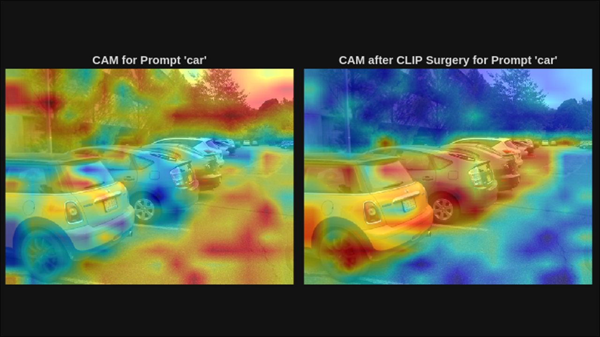

# Open Vocabulary CAM via CLIP Surgery

The example in this repository demonstrates how to perform open vocabulary 
Class Activation Mapping (CAM), a neural network explainability technique. 
This is achieved via CLIP Surgery \[[1](#references)], a training-free modification to OpenAI's
CLIP model that enables several downstream open vocabulary tasks.

The following image illustrates the class activation map for the prompt 
"car" before and after applying CLIP surgery.

## Setup
1. Download the repository and extract the contents.
2. Download the required products below.

### [MathWorks® Products](mathworks.com)

Requires MATLAB® release R2026a or newer with the following toolboxes/add-ons:
- [Computer Vision Toolbox®](https://www.mathworks.com/products/computer-vision.html)
- [Deep Learning Toolbox®](https://www.mathworks.com/products/deep-learning.html)
- [Computer Vision Toolbox Model for OpenAI CLIP Network](https://www.mathworks.com/matlabcentral/fileexchange/182171-computer-vision-toolbox-model-for-openai-clip-network)

## Getting Started
Run the [`openVocabularyCAMviaCLIPSurgery.m`](openVocabularyCAMviaCLIPSurgery.m) live script.

## Licence
The license is available in the [License.txt](License.txt) file in this GitHub repository.

## Community Support
[MATLAB Central](https://www.mathworks.com/matlabcentral/)

## References
[1] Li, Yi, et al. "A closer look at the explainability of contrastive language-image pre-training."
Pattern Recognition 162 (2025): 111409.

Copyright © 2026 The MathWorks, Inc.

